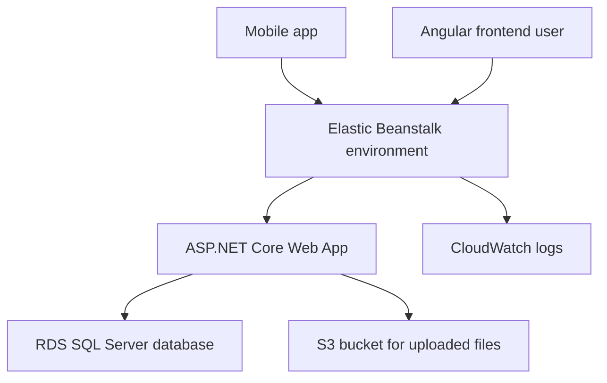

# AWS Elastic Beanstalk Staging Deploy Plan

## 1. Goal

Deploy the current RMS web application to AWS so the mobile team can use a staging API and the bundled Angular frontend before CI/CD is added.

Target scope:

- Host backend API and Angular frontend together from `src/Web/Web.csproj`.
- Use AWS Elastic Beanstalk for application hosting.
- Use Amazon RDS for SQL Server for the application database.
- Use Amazon S3 for uploaded files so files survive restart and redeploy.
- Deploy manually first.
- Add CI/CD later after staging is validated.

Responsibility split for this plan:

- Assistant scope: code-only preparation inside this repository, local build/test/publish support, migration artifact/command preparation, and documentation of required AWS settings.
- User scope: all AWS Console operations, including creating/configuring Elastic Beanstalk, RDS, S3, IAM, security groups, environment variables, uploading the deploy package, and checking AWS service health/logs in the console.
- The assistant must not assume direct AWS account access or perform AWS Console operations.

## 2. Current project facts

Relevant files:

- `src/Web/Web.csproj`
  - Publishes the ASP.NET Core backend.
  - Runs Angular build during publish through `PublishRunWebpack`.
  - Copies Angular `dist/browser` output to `wwwroot`.
- `src/Web/appsettings.json`
  - Currently uses local SQL Server LocalDB connection string for `RMSDb`.
- `src/Shared/Services.cs`
  - Database connection name is `RMSDb`.
- `src/Infrastructure/DependencyInjection.cs`
  - Uses EF Core SQL Server through `UseSqlServer`.
  - Registers `IFileService` as `LocalFileService`.
- `src/Infrastructure/ApplicationServices/LocalFileService.cs`
  - Saves files to local disk, which is not safe for Elastic Beanstalk staging because files can be lost after instance replacement or redeploy.
- `src/Infrastructure/Data/ApplicationDbContextInitialiser.cs`
  - Development database init currently uses destructive create flow. Staging must not run destructive database initialization.
- `src/Web/Program.cs`
  - Maps OpenAPI and Scalar API reference.
  - Serves static frontend assets.

## 3. Recommended AWS architecture



Components:

- Elastic Beanstalk application: `rms-staging`
- Elastic Beanstalk environment: `rms-staging-web`
- RDS SQL Server database: `RMSDb`
- S3 bucket: `rms-staging-uploads-<unique-suffix>`
- CloudWatch Logs: enabled through Elastic Beanstalk
- Domain initially: Elastic Beanstalk generated domain
- Custom domain and HTTPS: backlog after manual deploy validation

## 4. Code preparation checklist

### 4.1 Staging configuration

- Add staging-safe configuration without committing secrets.
- Keep `RMSDb` connection string outside source code.
- Configure staging through Elastic Beanstalk environment variables.
- Set `ASPNETCORE_ENVIRONMENT=Staging`.

Suggested environment variables:

- `ASPNETCORE_ENVIRONMENT=Staging`
- `ConnectionStrings__RMSDb=<rds-sql-server-connection-string>`
- `AWS__Region=<aws-region>`
- `Storage__Provider=S3`
- `Storage__S3__BucketName=<s3-bucket-name>`
- `Storage__S3__Prefix=uploads`

### 4.2 Database initialization

Required change:

- Do not run `EnsureDeleted` or `EnsureCreated` in staging.
- Use EF Core migrations or migration bundle for RDS SQL Server.
- Keep destructive reset only for local development.

Recommended approach for staging:

- Generate EF Core migrations if missing.
- Apply migrations manually from local machine against RDS after RDS security group allows your IP temporarily.
- Alternatively create an EF Core migration bundle and execute it against RDS.

### 4.3 S3 file storage

Required change:

- Add an AWS S3 implementation of `IFileService`.
- Register S3 implementation when `Storage__Provider=S3` or when environment is `Staging`.
- Keep `LocalFileService` for local development.

Implementation notes:

- Add AWS SDK package for S3 to `src/Infrastructure/Infrastructure.csproj`.
- Save object key using current relative path pattern.
- Store metadata in the existing `Files` table like current `LocalFileService`.
- Return stored path as S3 key or application-relative key depending current API behavior.

### 4.4 OpenAPI and mobile access

- Keep Scalar/OpenAPI available on staging while mobile integration is active.
- Confirm URLs after deploy:
  - `/openapi/v1.json`
  - `/scalar`
- Decide later whether these should be restricted before production.

### 4.5 CORS

Current CORS allows any origin in `src/Web/Program.cs`.

For staging mobile integration:

- It is acceptable temporarily if mobile needs quick access.
- Before production, restrict allowed origins to known frontend/custom domains.

## 5. AWS Console resource creation checklist for user

### 5.1 Region and naming

Pick one AWS region, for example:

- `ap-southeast-1` if Singapore is preferred.
- `ap-southeast-2` if Sydney is preferred.

Suggested names:

- Elastic Beanstalk app: `rms-staging`
- Elastic Beanstalk env: `rms-staging-web`
- RDS DB identifier: `rms-staging-sqlserver`
- Database name: `RMSDb`
- S3 bucket: `rms-staging-uploads-<unique-suffix>`

### 5.2 IAM

User handles in AWS Console:

- Create or use an IAM identity that can manage Elastic Beanstalk, S3, RDS, EC2 security groups, IAM instance profile, and CloudWatch Logs.
- Use Elastic Beanstalk EC2 instance profile.
- Grant the instance profile permission to access the S3 upload bucket.

Assistant handles in code/docs only:

- Document the minimum runtime permissions needed by the application.
- Ensure the application uses the Elastic Beanstalk instance profile/AWS default credential chain rather than committed access keys.

Minimum S3 permissions for runtime:

- `s3:PutObject`
- `s3:GetObject`
- `s3:DeleteObject` if delete will be implemented
- `s3:ListBucket` if needed

Scope permissions to the specific upload bucket.

### 5.3 S3

User handles in AWS Console.

Create S3 bucket:

- Block public access enabled by default.
- Server-side encryption enabled.
- Versioning optional for staging.
- Lifecycle cleanup optional for staging.

Create prefix/container convention:

- `uploads/`
- `uploads/application/`

### 5.4 RDS SQL Server

User handles in AWS Console.

Create RDS SQL Server:

- Engine: SQL Server Express or Web edition depending budget and limits.
- Database name: `RMSDb`.
- Public access: choose based on team network setup.
  - Quick staging: public access with security group restricted to your IP and Elastic Beanstalk security group.
  - Better staging: private access inside VPC.
- Backup retention: enable default automated backups.
- Storage autoscaling: optional.

Security group rules:

- Allow SQL Server port `1433` from your current public IP for migration only.
- Allow SQL Server port `1433` from Elastic Beanstalk instance security group.
- Remove or restrict your public IP rule after migration if not needed.

### 5.5 Elastic Beanstalk

User handles in AWS Console.

Create Elastic Beanstalk application/environment:

- Platform: .NET on Linux or Windows depending available AWS platform support for the target .NET runtime.
- Application type: Web server environment.
- Environment name: `rms-staging-web`.
- Enable CloudWatch Logs streaming if available.
- Configure health check path.

Environment properties:

- `ASPNETCORE_ENVIRONMENT=Staging`
- `ConnectionStrings__RMSDb=<rds-connection-string>`
- `AWS__Region=<region>`
- `Storage__Provider=S3`
- `Storage__S3__BucketName=<bucket-name>`
- `Storage__S3__Prefix=uploads`

## 6. Code-only preparation and manual deploy handoff checklist

### 6.1 Local prerequisites

Install or confirm:

- .NET SDK compatible with `global.json`.
- Node.js compatible with Angular project.
- npm.
- AWS CLI or AWS Toolkit if deploying from IDE.
- EF Core CLI if using migrations from local.

### 6.2 Assistant code/build validation

Assistant handles inside the repository.

From repo root, validate:

```powershell
dotnet restore
dotnet build
```

Run tests if practical:

```powershell
dotnet test
```

### 6.3 Assistant publish/package preparation

Assistant prepares the publish output and deployable zip when requested.

Publish the web app:

```powershell
dotnet publish .\src\Web\Web.csproj -c Release -o .\artifacts\rms-web-publish
```

Expected behavior:

- The publish target runs `npm install` in `src/Web/ClientApp`.
- The publish target runs Angular production build.
- Angular build output is copied into published `wwwroot`.

Package handoff for Elastic Beanstalk:

- Assistant creates or documents how to create the zip from the contents of `artifacts/rms-web-publish`, not the parent folder.
- User uploads the zip to Elastic Beanstalk as a new application version through AWS Console.

### 6.4 Database migration handoff

Assistant handles inside the repository/local environment:

- Check whether EF Core migrations exist.
- Generate migrations if needed.
- Prepare migration command or migration bundle for RDS SQL Server.
- Ensure staging does not run destructive database initialization.

User handles in AWS Console:

- Temporarily allow local IP to RDS security group if applying migration from local machine.
- Provide the RDS SQL Server endpoint/connection string through a secure channel or configure it directly as an Elastic Beanstalk environment property.
- Verify tables are created in RDS.
- Remove broad database access rules after migration.

### 6.5 User deploys to Elastic Beanstalk

User deploys the zip package manually through AWS Console Elastic Beanstalk upload and deploy.

Before deploy, user configures Elastic Beanstalk environment properties:

- `ASPNETCORE_ENVIRONMENT=Staging`
- `ConnectionStrings__RMSDb=<rds-connection-string>`
- `AWS__Region=<region>`
- `Storage__Provider=S3`
- `Storage__S3__BucketName=<bucket-name>`
- `Storage__S3__Prefix=uploads`

After deploy, user checks in AWS Console:

- Elastic Beanstalk health.
- Application logs in CloudWatch or Elastic Beanstalk logs.
- Environment variables are present.

Assistant can support by interpreting logs/errors that the user shares, but AWS Console actions remain user-owned.

## 7. Validation checklist

Shared validation after user deploys through AWS Console.

Validate staging URL:

- Angular frontend loads.
- API endpoints respond.
- Scalar page loads at `/scalar`.
- OpenAPI JSON loads at `/openapi/v1.json`.
- Login/register/auth flow works.
- Main mobile endpoints work.
- Create application flow works.
- Upload file flow stores object in S3.
- Database records are created in RDS.
- CORS does not block mobile calls.
- HTTPS/domain behavior is acceptable for staging.

## 8. Mobile handoff checklist

Provide mobile team:

- Staging base URL.
- OpenAPI URL.
- Scalar URL.
- Auth flow.
- Test account credentials.
- Main endpoint list.
- Upload API usage notes.
- Known limitations of staging.
- Contact owner for staging incidents.

## 9. CI/CD backlog

After manual deploy is validated:

- Add GitHub Actions build and deploy workflow.
- Option A: deploy to Elastic Beanstalk with AWS access key stored in GitHub secrets.
- Option B: deploy with GitHub OIDC to AWS IAM role.
- Add branch/environment rules for staging.
- Add build, test, publish, package, deploy steps.
- Add deployment rollback notes.

## 10. Production hardening backlog

Before real production:

- Move secrets to AWS Secrets Manager or SSM Parameter Store.
- Use IAM role instead of long-lived access keys where possible.
- Add CloudWatch alarms.
- Add structured log retention policy.
- Add Route 53 custom domain.
- Add ACM certificate and HTTPS listener.
- Review CORS restrictions.
- Review authentication cookie/token settings for mobile.
- Review RDS backup retention and restore process.
- Test restore from backup.
- Consider private networking for RDS.
- Add WAF if public API requires protection.

## 11. Current agreed plan status

- AWS target selected.
- Elastic Beanstalk selected for fast manual deploy.
- RDS SQL Server selected to keep current EF Core SQL Server implementation.
- S3 selected for durable uploaded files.
- Manual deploy selected first.
- CI/CD deferred to backlog.
- Assistant implementation scope is code-only inside this repository.
- User owns all AWS Console operations and AWS resource configuration.
